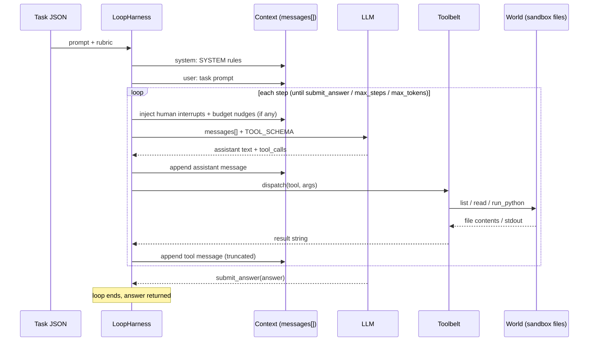

# AI loop harness

**`LoopHarness`** (`harness/agent.py`) sits between four things: the **task prompt** (what to do), the **world** (files the agent can read), the **LLM** (decides next actions), and the **tools** (how actions touch the world). It runs a repeating cycle—build chat context → call model → run any tool calls → feed results back into chat—until the model calls **`submit_answer`** or limits hit.

## How task, world, tools, harness, and LLM interact

**Task (prompt)** — Loaded from task JSON: the **`prompt`** field is the main user message. The agent is not given a file list; the prompt describes the accounting job (e.g. find a workpaper, compute percentages). The harness also sends a fixed **`SYSTEM`** block: role (staff accountant), rules (no invented numbers, use files and `run_python`), and that the only way to finish is **`submit_answer`**.

**World** — A per-run directory tree (workpapers, QBO exports, task-specific files) copied into a sandbox. The LLM never sees raw paths on disk; it only sees **tool outputs** that describe what was read or listed. All tool paths are workspace-relative (`.` is the root of that world).

**Tools** — OpenAI-style functions defined in **`TOOL_SCHEMA`**; execution is **`Toolbelt.dispatch`** against the sandbox. The model chooses tools; the harness executes them and appends each result as a **`tool`** message so the next LLM turn can reason over real file contents and script output.

**Harness** — Owns the step counter, token budget, pause gate, human inbox, and the growing **`messages`** list. Between steps it may inject harness **`user`** lines (“use tools or submit”, “last turn—submit now”) and operator **`user`** lines from the inbox. It calls the API, parses **`tool_calls`**, runs tools in order, emits events via **`emit`**, and stops when **`submit_answer`** sets the final string.

**LLM** — OpenAI-compatible chat with **`tools=TOOL_SCHEMA`**. Each turn it returns optional visible text and/or one or more function calls. It does not read the filesystem directly; every fact about the world enters through prior **`tool`** messages (and the task prompt’s instructions).

### One step, end to end

1. Harness runs **`_checkpoint`**: wait if paused; merge any inbox text into **`messages`** as a human interrupt.
2. Harness calls **`chat.completions.create`** with current **`messages`** + schemas.
3. LLM responds → harness appends **assistant** message (content + **`tool_calls`**).
4. For each call: harness → **`Toolbelt`** → files/python in world → string result → append **tool** message (truncated for context size).
5. If the call was **`submit_answer`**, the loop ends with that answer. Otherwise go to step 1.

**Local provider:** same tool/world path, but the harness plays scripted “thinking” and fixed tool calls instead of an LLM (inbox cannot change the script).

## Tools

Schemas live in `harness/tools.py` as **`TOOL_SCHEMA`**; behavior in **`Toolbelt`**.

| Tool                | What it does                                      | World interaction                                                           |
| ------------------- | ------------------------------------------------- | --------------------------------------------------------------------------- |
| **`list_dir`**      | Lists entries under a relative path               | Reads directory metadata only                                               |
| **`read_file`**     | Text/CSV slice with offset/limit                  | Reads file bytes; rejects xlsx/pdf (directs to other tools)                 |
| **`inspect_xlsx`**  | Sheet names + first rows (xlsx or csv)            | Opens workbook via openpyxl / csv reader                                    |
| **`read_xlsx`**     | Tabular rows from a sheet or csv with skip/limit  | Same files, deeper read                                                     |
| **`read_pdf`**      | Extracted text (capped)                           | pypdf over PDF in sandbox                                                   |
| **`run_python`**    | Runs a snippet as a subprocess with cwd = sandbox | Can import pandas/openpyxl/numpy; reads/writes files under `.`; 45s timeout |
| **`submit_answer`** | Sets the run’s final answer string                | No filesystem I/O; ends the loop                                            |

Path safety: no `..`, no absolute paths. Failed tools return error strings as tool content so the LLM can retry.

**`run_python`** writes a temporary `.__agent_exec.py` in the workspace, runs `python -u` there, deletes the script, returns stdout/stderr. This is how the model does arithmetic and re-aging logic the prompt requires.

**`submit_answer`** is the bridge from chat back to the harness: **`dispatch`** returns a non-`None` answer and the harness stops calling the LLM.

## What the model sees vs what it does not

| Sees                                 | Does not see                                                 |
| ------------------------------------ | ------------------------------------------------------------ |
| Task **`prompt`** (first user turn)  | Full rubric/scoring (harness uses rubric later; not in chat) |
| **`SYSTEM`** rules                   | Host UI, SSE, run ids                                        |
| Prior assistant turns + tool outputs | Unlisted files until **`list_dir`** / reads find them        |
| Harness and human **`user`** nudges  | Files outside the sandbox                                    |

## Harness controls (same loop)

| Mechanism                      | Effect on interaction                                                                                       |
| ------------------------------ | ----------------------------------------------------------------------------------------------------------- |
| **`gate`**                     | Cleared → loop blocks before the next LLM call; world and messages unchanged while waiting                  |
| **`inbox`**                    | Text becomes an extra **`user`** message on the next checkpoint; LLM must treat it as overriding prior plan |
| **`max_steps` / `max_tokens`** | Extra **`user`** messages pressure **`submit_answer`**; does not change tools or world                      |

## Events during the loop

Harness **`emit`** dicts (host may attach metadata). Loop-relevant types:

| `type`                                      | Interaction                                        |
| ------------------------------------------- | -------------------------------------------------- |
| `harness_prompt`                            | Snapshot of system + task prompt sent to the model |
| `workspace_ready`                           | Which world files exist at sandbox root            |
| `step_started`                              | Step index, budget                                 |
| `llm_request` / `llm_thinking` / `llm_text` | Model turn                                         |
| `tokens`                                    | Usage affecting remaining budget                   |
| `tool_call` / `tool_result`                 | LLM intent → world effect → text back to chat      |
| `file_touch`                                | Paths touched by recent tool ops                   |
| `user_message_injected`                     | Inbox merged into **`messages`**                   |

## Code map

| File                   | Role in the interaction                                     |
| ---------------------- | ----------------------------------------------------------- |
| `harness/agent.py`     | **`LoopHarness`**, **`SYSTEM`**, message loop, LLM vs local |
| `harness/tools.py`     | **`TOOL_SCHEMA`**, **`Toolbelt`**                           |
| `harness/workspace.py` | Builds the sandbox **world** the tools mount                |
| `harness/tasks.py`     | **`prompt`** (+ slug for extra world files)                 |
| `harness/config.py`    | Provider URLs/keys, default models, step/token caps         |
